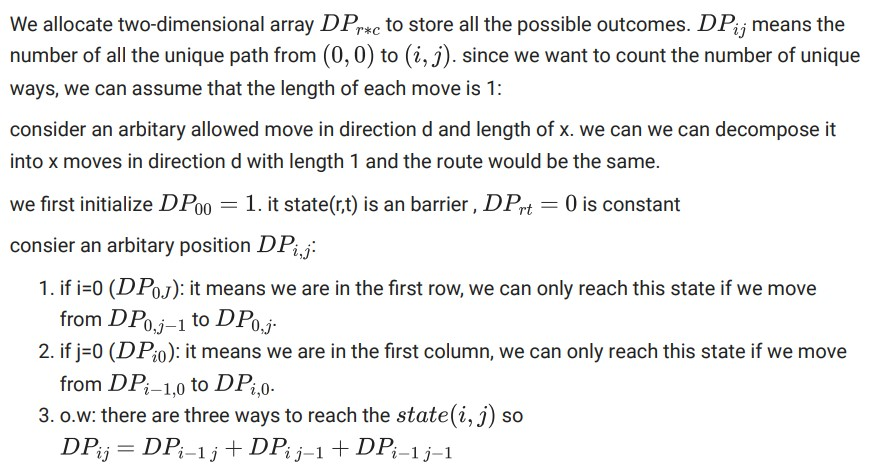

# Unique Paths in a Grid with Obstacles
 
an agent can move left, right, or diagonal in a 6*6 grid. It also should not run into the barriers. We want to count all the unique ways the agent can move from A to B.
 

  

  

  
 
# Edit Distance
 
 
Google will suggest the possible phrase of a misspelled word. For example, in the figure below, the word"inplememtation" is searched, and Google returns its search results for the correct spelling of the word "implementation".
 

  
As a simple solution, we can define criteria by which we can have the best possible prediction of the possible string. If we call the searched string s1 and the predicted string s2, our criterion should return the similarity value between the two defined strings. Then, among the obtained values, we can return the most appropriate string s2.
 

  
We want to get from the string 1s to 2s using three operators: deletion, insertion, Substitution, and replacement. Among the defined operators, the insertion and deletion operators will have 1 cost each and the substitution operator will have 2 costs. For example, there are two ways to get from the word "index" to "inside".
 
 
We want to find the least cost c to get the word s2 from s1. in word suggestion the word with the smalles c is the best candidate.
 

  
 

  

  

  

 
# Longest Common Subsequence
 
 
The sub-series of the string s is equal to any subset of its characters whose order in the sub-series is similar to the order of their placement in the string s. For example, the string "aca" is a sub-series of three of the main string "abcba".
 

  
We want to find the longest common subsequence of 2 stirngs.

  

  

  
  
 
# Calculate Sum by Restating the Problem
 
 
We want to find the sum of the sequence below:
 

 

 

 

 
